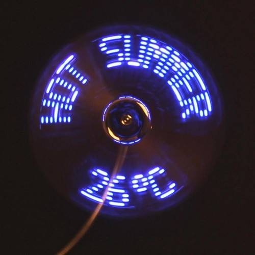

DreamyFan
=========
*DreamyFan is a GNU/Linux Kernel Driver for 'PEARL.fr' USB LED fan.*

<div style="text-align:center"></div>

## Dependencies

Common:

* *libusb-1.0* - Library that provides generic access to USB devices

Archlinux:

* *linux-headers* - Header files and scripts for building modules for Linux kernel
* *netpbm* - Toolkit for manipulation of graphic images (with libraries and header files)

Ubuntu:

* *linux-headers-{kernel_version}*
* *libnetpbm10-dev* - Netpbm libraries and header files

## Build

```
$ make
```

## Run

* Run the program using libusb:
```
$ cd src/userapp/libusb_app
$ ./app <config_file>
```
**config_file**: path of a config file that contains image paths and effect configuration (cf. Configuration File).

* Run the program using the kernel module driver (cf. Module Driver):
```
$ cd src/userapp/driver_app
$ ./app <config_file>
```

## Module Driver

* You need to load the module driver before running the program:

```
$ cd src/driver
$ chmod +x script.sh
$ ./script.sh
```

## Configuration File

### Sample

You could find a given example of a basic `config` file in each program directory.

```
$ cd src/userapp/libusb_app
$ cat config
+./images/image1.pbm+2/2/6
+./images/image2.pbm+1/1/6
+./images/image3.pbm+0/0/0
+./images/image4.pbm+3/3/6
+./images/image3.pbm+2/5/0
```

**image.pbm**: Netpbm data image, size = 156x11.<br />
**.PBM**: Well-known format supported by image manipulation programs like Gimp.

### How to write a config file ?

* Required at most 8 images so 8 lines
  * 2 x lines: ok
  * 9 x lines: failed
  * 0 x line: failed

* Line: `+{path}+{x}/{y}/{z}`
  * path: valid .pbm filepath
  * x: Opening effect [0-5]
  * y: Closing effect [0-5]
  * z: Rotation effect [0,6,c]

## TODO

* Add section to explain entirely how to upload .PBM image files into the fan
* CMake instead of *make*
* Remove the module driver and clean libusb app
